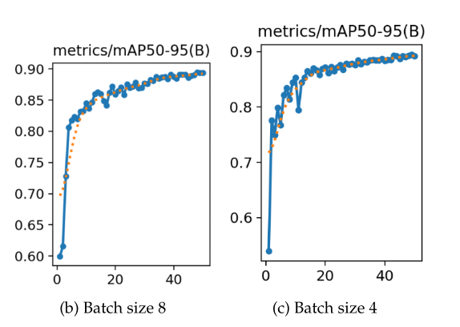

# SocialMind - Backend
**SocialMind** A web platform for personality analysis based on Instagram accounts.          
The Instagram accounts data can be added manually filling each field and adding photos (profile/posts photos) or by choosing to introduce a screenshot (wiht the profile or post data) and a pretrained YOLO algorithm will extracct the data automatically.            
The data is persisted using a PostgreSQL db and the instagram social media accounts are analysed by a Gemini flash 2.0 model or if it's not available, Ollama model will be used (which is not as accurate as GEMINI).
## Used technologies
The server is built using Python and a set of modern libraries to ensure performance and scalability:
    
**Framework**: FastAPI  
**Database**: PostgreSQL    
**ORM**: SQLAlchemy     
**Data validation**: Pydantic       
**Authentication**: JWT (JSON Web Tokens)       
**Real-time communication**: WebSockets     
**Image processing**: OpenCV        
**Object Detection**: YOLOv11m (with the ultralytics library)   
**Text extraction (OCR)**: Pytesseract      
**Language identification**: Lingua (for shorter texts -> better accuracy) and FastText (lid218)   
**Automatic translation**: NLLB-200 (600M) model    
**Personality analysis**:   
1. Google Gemini Flash 2.0 API      
2. Local model gemma3:4b-it-qat via Ollama (as a fallback solution)  
    
## Principal functionalities
**Secure authentication**: Account creation and login using JWT tokens  
**Automatic data extraction**: Processes screenshots of Instagram profiles and posts to automatically extract images, text, and metadata using custom YOLOv11m models and Tesseract OCR.    
**Linguistic processing**: Detects the language of the extracted text and automatically translates it to English for consistent analysis.   
**Personality analysis generation**: Uses multimodal AI models (Gemini or Gemma - Ollama) to generate a detailed psychological profile, based on the Big Five (OCEAN) model, along with hobbies, interests, and dominant emotions.   
**Account management**: Allows users to add, view, and manage the analyzed Instagram accounts.      
**Image serving**: Stores the images on the file system and efficiently serves them to the frontend.
        
## Training YOLO models
In order to train yolo for my task to select the intereset sections from a screen capture (profile photo, description, no of likes etc.) i needed to create a dataset on which to train the YOLO models.    
I used **Roboflow** in which i uploaded all the screen-captures i made on instagram profiles/posts, and then added bounding boxes for the interest sections in each image, then created the dataset dividing the images on training/validation/test sets.    

# Train YOLOv11m on insta profiles - no augmentation dataset 355 images; augmentation dataset: 595 images

| ImgSize | Detect from profile images (trained on Kaggle) | Blur&Noise | Batches | Confidence threshold (default=0.25) | mAP50 | mAP50-95 | Time |
| :------ |:-----------------------------------------------| :--------- | :------ | :---------------------------------- | :---- | :------- | :--- |
| 800px   | 100 epochs                                     | no         | 16      | 0.5                                 | 0.991 | 0.783    | 0.608 h |
| 800px   | 100 epochs                                     | yes        | 16      | 0.5                                 | 0.993 | 0.738    | 0.970 h |
| 800px   | 100 epochs                                     | no         | 8       | 0.5                                 | 0.992 | 0.763    | 0.645 h |
| 800px   | 100 epochs                                     | yes        | 8       | 0.5                                 | 0.994 | 0.732    | 1.067 h |
| 800px   | 100 epochs                                     | no         | 4       | 0.5                                 | 0.992 | 0.767    | 1.526 h |
| 800px   | 100 epochs                                     | yes        | 4       | 0.5                                 | 0.993 | 0.733    | 1.230 h |
The highest mAP50-95 is on the first configuration (first row)
    
# Train YOLOv11m on insta posts - no augmentation dataset 730 images; augmentation dataset: 1215 images 

| ImgSize | Detectare postări Instagram (antrenare pe Kaggle) | Blur&Noise | Batches | Confidence threshold (default=0.25) | mAP50 | mAP50-95 | Time |
| :------ | :--------------------------------------------- | :--------- | :------ | :---------------------------------- | :---- | :------- | :--- |
| 800px   | 50 epochs                                      | no         | 16      | 0.5                                 | 0.994 | 0.890    | 0.563 h |
| 800px   | 50 epochs                                      | yes        | 16      | 0.5                                 | 0.994 | 0.893    | 0.978 h |
| 800px   | 50 epochs                                      | no         | 8       | 0.5                                 | 0.994 | 0.894    | 0.618 h |
| 800px   | 50 epochs                                      | yes        | 8       | 0.5                                 | 0.994 | 0.893    | 1.187 h |
| 800px   | 50 epochs                                      | no         | 4       | 0.5                                 | 0.994 | 0.894    | 0.710 h |
| 800px   | 50 epochs                                      | yes        | 4       | 0.5                                 | 0.994 | 0.890    | 1.225 h |

On the 3-th and 5-th row we have the same mAP50-95, so I chose to look at the mAP50-95 graphic evolution to analyse which one performs better:
## Graphics mAP50-95 for no augmentation (no blur/noise) for the 3-th and 5-th rows which have the highest mAP50-95
     
The training graph with batch-size 4 shows some fluctuations, especially at the beginning of the training (epochs 1 to 20).     
The model trained with batch-size 8 not only has the highest mAP50-95 value but also the best graph compared to the other configurations (very small fluctuations, more stable learning curve).
    
In conclusion i chose the model with batch-size 8, no blur/noise